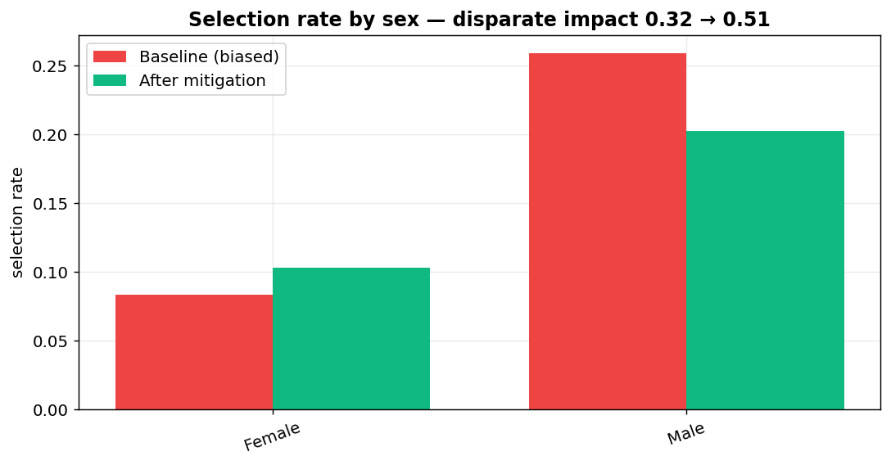
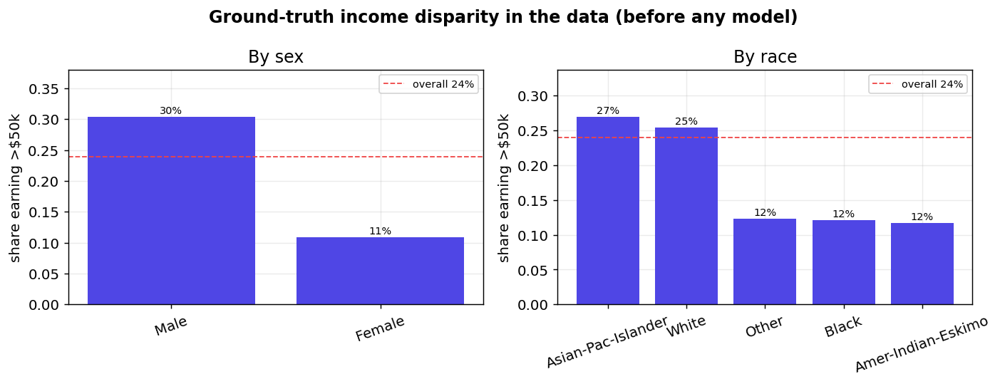

# FairLens 🔍

**An accurate model is not the same as a fair one.** FairLens audits a real
income-prediction classifier for demographic bias, proves the harm with
legally-grounded metrics, and fixes most of it with a single toggle — all in an
interactive dashboard anyone can explore.

> Built for the **AI For Good Hackathon** · *ACM-W Data Science Ethics* track.



---

## The problem

Machine-learning models increasingly decide who gets a **loan, an interview, or
a benefit**. They're optimized for *accuracy* — but accuracy says nothing about
*fairness*. A model can score 87% accuracy and still systematically deny
opportunities to women or to a racial group, and nobody notices because the
aggregate number looks great.

FairLens makes that hidden harm **visible, measurable, and fixable.**

## What it does

Using the classic **UCI Adult / Census Income** dataset (48,842 people), FairLens:

1. **Cleans** the data with a documented, reproducible pipeline.
2. **Trains** a strong gradient-boosting income classifier (87.6% accuracy, 0.93 ROC-AUC).
3. **Audits** it for bias by `sex` and `race` using formal fairness metrics.
4. **Mitigates** the bias with Fairlearn's `ThresholdOptimizer` and shows the
   exact accuracy cost of being fair.
5. Wraps it all in a **Streamlit dashboard** where you slide the decision
   threshold and toggle the mitigation to watch fairness change in real time.

## Headline results

| Protected attribute | Disparate-impact ratio | Four-fifths rule | Equalized-odds gap |
|---|---|---|---|
| **Sex** (baseline) | **0.32** | ❌ adverse impact | 0.08 |
| Sex (after mitigation) | 0.51 | — | **0.03** |
| **Race** (baseline) | **0.21** | ❌ adverse impact | 0.39 |
| Race (after mitigation) | 0.54 | — | **0.17** |

> The U.S. EEOC's **four-fifths rule** treats any selection-rate ratio **below
> 0.80** as evidence of *adverse impact* (potential illegal discrimination).
> The baseline model fails it badly for both attributes. Mitigation closes most
> of the error-rate gap for **~1 accuracy point**.



Even before modeling, the data is unequal: women earn >$50k at **11%** vs men at
**30%**. A naive model learns — and amplifies — this historical inequality.

## How it works

```
src/pipeline.py      load → clean → train → audit → mitigate → write artifacts
        │
        ├── outputs/metrics.json          all performance + fairness numbers
        └── outputs/test_predictions.csv  per-person scores + group labels
                  │
   app.py ────────┘   interactive dashboard reads the artifacts
   notebooks/analysis.ipynb   full executed data-science narrative
```

## Run it locally

```bash
python -m venv .venv
.venv\Scripts\activate          # Windows  (source .venv/bin/activate on macOS/Linux)
pip install -r requirements.txt

python src/pipeline.py          # reproduce all artifacts (~1 min)
streamlit run app.py            # launch the dashboard at http://localhost:8501
```

The full analysis with embedded charts and tables is in
[`notebooks/analysis.ipynb`](notebooks/analysis.ipynb).

## The data science

- **Cleaning:** the raw data spells "missing" three ways (whitespace, `?`, true
  `NaN`). A common bug is stripping whitespace *before* handling nulls, which
  turns `NaN` into the string `'nan'` and hides 3,620 missing values — FairLens
  normalizes all spellings to one `NaN`, then mode-imputes. We drop `fnlwgt` (a
  survey weight, not a feature) and `education` (redundant with `education-num`).
- **Model:** `HistGradientBoostingClassifier` on one-hot-encoded features, 70/30
  stratified split.
- **Fairness metrics:** selection rate, TPR/FPR per group, demographic-parity
  difference, **disparate-impact ratio** (four-fifths rule), **equalized-odds
  difference** — all via [Fairlearn](https://fairlearn.org/).
- **Mitigation:** `ThresholdOptimizer` (post-processing, equalized-odds
  constraint) — no retraining required.

## Ethical framing & limits

- **"Fairness through unawareness" doesn't work.** Dropping `sex`/`race` leaves
  proxies (`relationship`, `marital-status`) that re-encode them.
- There is **no single definition of fairness** — demographic parity and
  equalized odds can conflict. FairLens shows the trade-off rather than hiding it.
- Adult is a **1994 US Census** snapshot used here as a well-understood
  benchmark; the *method*, not this dataset, is the contribution.

## Tech stack

`Python` · `pandas` · `scikit-learn` · `Fairlearn` · `Plotly` · `Streamlit` · `Jupyter`

## License

MIT — see [LICENSE](LICENSE).
